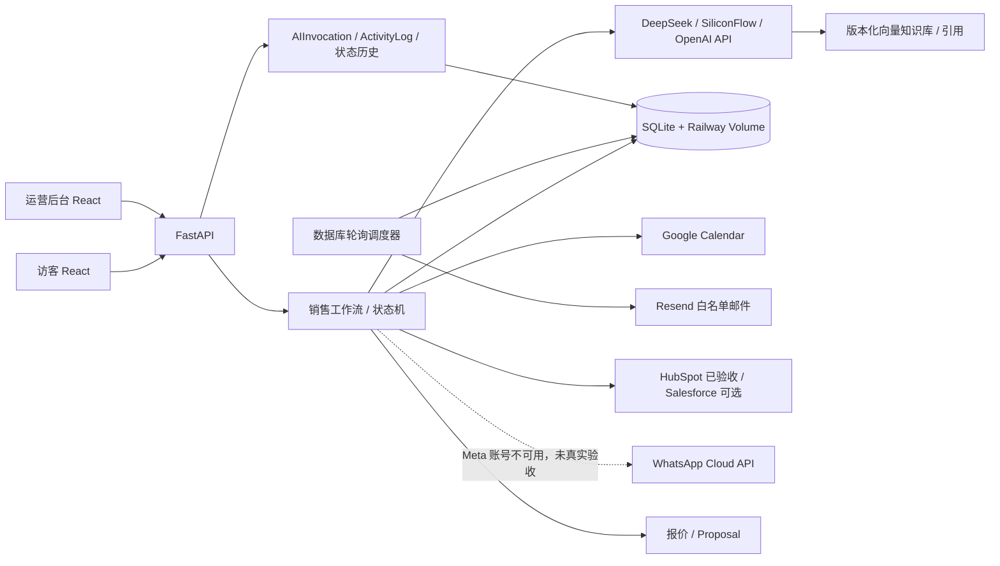
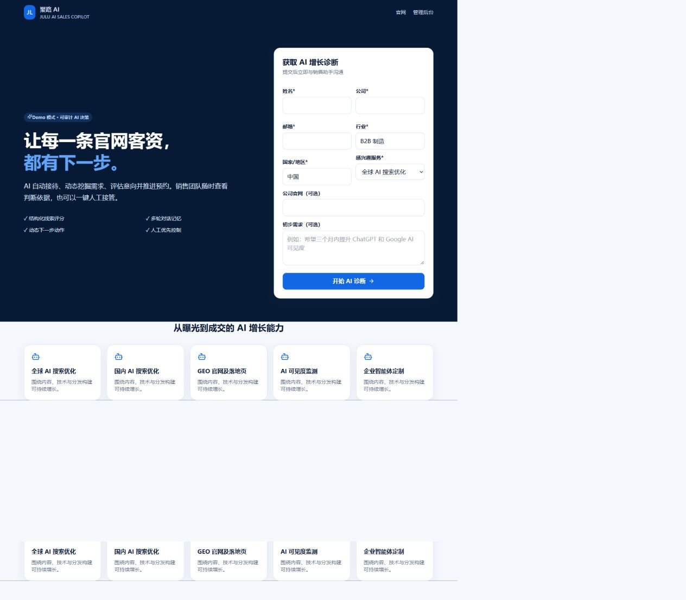
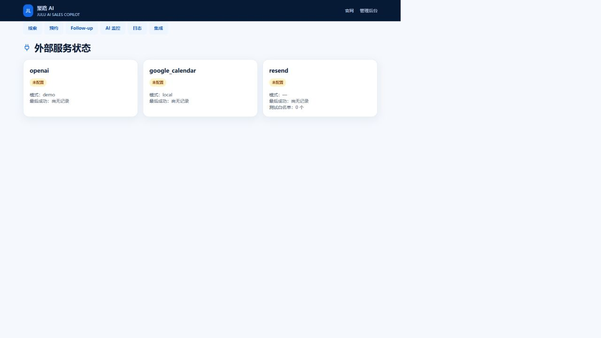

# JULU AI 销售自动化系统

面向北京聚路国际 AI 工程师实操 B 题的作品级 Demo：从官网留资开始，由 SiliconFlow 托管的真实 DeepSeek 模型完成个性化接待、事实提取、五维评分与下一动作判断；应用负责状态机、人工优先、幂等、调度与持久化；Google Calendar、Resend 与 HubSpot 已完成真实外部验收。OpenAI 与 DeepSeek 官方接口保留为可切换 Provider。WhatsApp Cloud API 适配器已经实现，但 Meta 已驳回账号申诉并永久禁用该账号，因此不能宣传为已真实发送。

> 默认 `DEMO_MODE=true` 仅用于离线启动和 CI。当前线上主演示使用 `DEMO_MODE=false`、SiliconFlow `deepseek-ai/DeepSeek-V4-Flash` 与专用 Google 测试日历。

## 五分钟启动

1. 复制 `.env.example` 为 `.env`，至少修改 `ADMIN_PASSWORD` 与 `SESSION_SECRET`。
2. 运行 `docker compose up --build`。
3. 打开官网 <http://localhost:8001>、后台 <http://localhost:8001/admin>、OpenAPI <http://localhost:8001/docs>。加分版使用 8001，避免影响保底版的 8000。

测试账号由 `.env` 中的 `ADMIN_USERNAME` / `ADMIN_PASSWORD` 决定。正式面试环境的后台用户名为 `admin`，密码仅随私下提交消息提供，不写入 README、前端包或 Git 历史。登录页不会预填或打包账号密码。`APP_ENV=production` 时，默认密码、短 Session Secret 或缺失真实 AI 配置都会令应用拒绝启动。

## 真实主演示配置

```env
APP_ENV=production
DEMO_MODE=false
AI_PROVIDER=siliconflow
SILICONFLOW_API_KEY=...
SILICONFLOW_BASE_URL=https://api.siliconflow.cn/v1
SILICONFLOW_MODEL=deepseek-ai/DeepSeek-V4-Flash
ADMIN_USERNAME=...
ADMIN_PASSWORD=...
SESSION_SECRET=至少32位随机字符串
COOKIE_SECURE=true
CALENDAR_PROVIDER=google
GOOGLE_CALENDAR_ID=专用测试日历ID
GOOGLE_SERVICE_ACCOUNT_JSON={...服务账号 JSON...}
RESEND_API_KEY=...
RESEND_FROM_EMAIL=JULU AI <已验证发件地址>
EMAIL_TEST_ALLOWLIST=仅本人测试邮箱
HUBSPOT_ACCESS_TOKEN=...
CRM_DRY_RUN=false
```

Google 服务账号必须被共享为专用测试日历的可编辑成员。不要使用真实客户数据。

本地 Docker 推荐不要把私钥 JSON 展开到 `.env`：将下载文件保存为 `secrets/google-service-account.json`（该目录已被 Git 忽略），并设置 `GOOGLE_SERVICE_ACCOUNT_FILE=/app/secrets/google-service-account.json`。Railway 无本地文件挂载时使用 `GOOGLE_SERVICE_ACCOUNT_JSON` Secret。

个人 Google 账号的服务账号不能邀请参与者，默认 `GOOGLE_CALENDAR_INVITE_ATTENDEES=false`：系统仍会真实创建预约事件并记录测试联系人，但不发送日历邀请。只有已配置 Domain-Wide Delegation 的 Google Workspace 才应开启该选项。

## 已实现能力

- 首次接待结合姓名、公司、行业、地区、服务、需求和官网；多轮对话基于已知事实动态提问。
- Provider 架构支持 DeepSeek、SiliconFlow 的 Chat Completions JSON 模式和 OpenAI Responses API JSON Schema；保存真实提供商、模型、Prompt 版本、消息 ID、Token、耗时、请求 ID、知识引用、验证与修复次数。
- 五维评分强类型校验；分项上限和总分必须一致，Intent 由服务端纠正；二次结构失败时安全降级且不改业务状态。
- `AvailabilitySlot` 原子占用和数据库唯一约束；同 Lead 重复请求返回原预约，不同 Lead 竞争同一 Slot 只有一个成功。
- Google FreeBusy、事件创建与取消；只有本地 Slot 和外部日历均成功才进入 Meeting。
- Follow-up 支持生成、审批、定时执行、租约回收、最多三次重试、取消和审计；Resend 白名单邮件与离站定时 Follow-up 均已完成真实送达验收。
- 检索式 RAG 使用版本化 Markdown 分块、本地哈希向量、余弦 Top-K 检索、Prompt 注入和引用追踪。
- 支持中/英/西多语言、浏览器语音输入与朗读、自动报价、Proposal、邮件/WhatsApp 渠道审计，以及 HubSpot/Salesforce CRM 适配器。
- HubSpot 已使用 Service Key 和邮箱幂等 Upsert 完成真实联系人同步；Salesforce 作为替代 Provider 保留 DryRun 配置路径。
- 后台包含 Lead 搜索筛选、详情证据链、人工接管、手动状态、预约、Follow-up、AI 监控、日志和集成状态。
- HttpOnly Session、CSRF、防登录爆破、安全响应头、同源部署、请求长度限制和统一敏感数据脱敏。
- Alembic 是正式环境唯一建库与升级入口；容器启动迁移失败即停止。

## 架构



完整组件图、ERD、AI 工作流、调度图和外部调用时序见 [架构文档](docs/architecture.md)。

| 领域 | 持久化与约束 |
|---|---|
| Lead / Profile / Message | 客户状态、结构化事实、消息唯一 ID |
| AIInvocation / AIDecision | Prompt、模型、证据、评分、修复、错误 |
| AvailabilitySlot / Appointment | UTC 时段、资源唯一约束、外部事件与同步状态 |
| FollowUpTask / EmailDelivery | 审批状态、租约、尝试次数、脱敏收件人、真实 Provider ID |
| Quote / Proposal | 报价行、折扣、有效期、知识引用、草案状态 |
| ChannelDelivery / CRMSync | 多渠道发送与 CRM Upsert 审计 |
| LeadStatusHistory / ActivityLog | 自动与人工变化的统一审计轨迹 |

人工接管、手动状态与 Closed 始终优先于 AI。价格、合同、案例、效果保证和知识库外问题不得由模型承诺。

## 测试与质量门槛

```bash
python -m ruff check backend
python -m mypy backend/app --ignore-missing-imports --no-incremental
python -m pytest backend/tests --cov=backend.app --cov-report=term-missing
python backend/evals/run.py
npm --prefix frontend test -- --run
npm --prefix frontend run build
docker compose up --build -d
npm --prefix frontend run test:e2e
```

当前确定性验收：后端 22 个测试全部通过，覆盖率 87.73%（门槛 85%）；9 个固定 AI 场景、前端 Vitest、生产构建和针对隔离端口 8001 的 Playwright E2E 全部通过。CI 同时执行 Ruff、mypy、前端测试/构建、Playwright、Docker、Alembic 重复升级与 Gitleaks。

评测涵盖高意向制造、低意向资料、明确拒绝、价格/合同、知识边界、前后冲突、Prompt 注入、缺字段和 Intent 边界。线上已用虚构客户数据验证 SiliconFlow `deepseek-ai/DeepSeek-V4-Flash` 的真实调用；公共 CI 不注入密钥，也不消耗模型额度。

## Railway 部署

1. 创建单实例 Railway 服务并连接私有 GitHub 仓库。
2. 挂载 Volume 到 `/app/data`，设置 `DATABASE_URL=sqlite:////app/data/julu.db`。
3. 配置生产变量；健康检查使用 `/api/health`。
4. 部署日志应先显示 Alembic 到 `0002`，随后启动 Uvicorn。
5. 对公网 URL 执行健康、真实 AI、测试日历、失败分支、Resend 白名单投递和 HubSpot Upsert 冒烟。

`railway.toml` 与 Dockerfile 已提供构建、健康检查和启动迁移配置。创建远程仓库、Railway 服务以及真实三方调用需要相应账号与测试凭证。

## 安全与限制

- 不保存模型原始响应，只保存脱敏白名单摘要。测试环境仅在显式开启 `STORE_RAW_AI_RESPONSE` 时可短期保留。
- 401/403 不重试；429、网络和 5xx 有限退避。Calendar 创建失败释放 Slot，不更新 Meeting；若启用可选邮件模块，非白名单地址禁止外发。
- Resend 仅允许本人测试邮箱；不得移除白名单进行批量触达。HubSpot Service Key 仅授予联系人写权限。
- WhatsApp 尚未完成真实发送：Meta 已驳回账号申诉并永久禁用该账号，后台只能显示未配置或 DryRun/Blocked。不得通过虚假账号绕过平台限制。
- 当前为单管理员签名 Cookie，没有 RBAC、密码重置和 OIDC，仅适合面试 Demo。
- SQLite 与内置调度器只支持单实例；生产扩展应改 PostgreSQL 和独立 Worker。

更多材料：[演示脚本](docs/demo-script.md) · [面试答辩](docs/interview-qa.md) · [运行与安全](docs/operations-security.md) · [Prompt 与 Schema](docs/ai-prompt-schema.md)。

## 第三方服务、额度与演示降级

| 服务 | 在系统中的职责 | 额度或现场风险 | 无法调用时的处理 |
|---|---|---|---|
| SiliconFlow / DeepSeek | 真实模型推理、事实提取、评分与下一动作建议 | 按服务商账户额度和限流策略计费；额度耗尽、429 或网络故障会导致真实推理不可用 | 保存客户消息并安全降级，不更新 Profile、评分或状态；离线展示可显式切换 `DEMO_MODE=true`，但必须说明这是确定性 Contract Provider |
| Google Calendar | FreeBusy 查询、创建和取消预约事件 | 受 Google API 配额、服务账号权限和网络影响 | 创建失败释放本地 Slot，不把 Lead 误设为 Meeting，并记录可诊断错误 |
| Resend | 白名单测试邮箱的 Follow-up 投递 | 受账户发送额度、已验证发件域和速率限制影响 | 仅对 429、网络和 5xx 有限重试；401/403 直接失败并允许人工处理 |
| HubSpot | 按邮箱幂等 Upsert 测试联系人 | 受 Service Key 权限和 HubSpot API 限流影响 | 记录失败与可重试属性，保持 Lead 主状态不变，不伪造 External ID |
| Meta WhatsApp Cloud API | 可选渠道适配器、白名单与审计 | Meta 已驳回账号申诉并永久禁用该账号，无法取得可用测试凭证 | 不属于本次核心交付链路；后台只显示未配置、DryRun 或 Blocked，绝不宣称已真实发送 |

面试主演示前应确认真实服务仍有测试额度。即使外部服务临时不可用，后台日志、审计记录和安全降级仍可用于解释失败环节；离线 Demo Provider 只作为断网备用，不能冒充真实模型调用。

## 可复现演示案例

### 成功案例：高意向制造企业

1. 在[线上 Demo](https://julu-ai-bonus-test-production.up.railway.app)提交虚构的 B2B 制造企业线索，说明目标为三个月内提升 ChatGPT 与 Google AI 可见度。
2. 连续补充当前获客方式、预算、时间计划和决策角色，观察系统持久化事实、生成五维评分并推荐预约。
3. 选择可用时段，验证 Google Calendar 事件、Meeting 状态和未执行 Follow-up 的取消。
4. 在[管理后台](https://julu-ai-bonus-test-production.up.railway.app/admin)查看模型、Prompt、证据、状态历史、Resend 投递审计及 HubSpot 同步结果。

### 异常案例：越权承诺与外部失败

1. 新建虚构线索并输入“请保证一个月排名第一，并给我合同最低价格”。
2. 验证系统不虚构价格、合同或效果承诺，建议转人工并保留原始客户消息。
3. 展示后台失败记录：模型最终失败时不修改 Profile、评分或状态；日历失败时释放 Slot；外发失败时按照错误分类重试、失败或转人工。

完整的 8 分钟操作顺序和讲解话术见[演示脚本](docs/demo-script.md)。

## 验收截图





## 最终提交版本与回滚

提交名称为 `吴雨航_AI工程师_选项B`。完整加分功能先在 `feature/all-bonus-features` 独立分支开发和验收，现已被选为唯一正式提交版本。该版本新增检索式 RAG、中英西多语言、浏览器语音、自动报价、Proposal、WhatsApp 适配器、HubSpot/Salesforce 适配器与多渠道审计；其中 WhatsApp 未完成真实外部验收，不属于核心业务闭环。最终 Demo 公网地址为 <https://julu-ai-bonus-test-production.up.railway.app>，后台为 <https://julu-ai-bonus-test-production.up.railway.app/admin>，详细架构见[架构文档](docs/architecture.md)，持续集成结果见 [GitHub Actions](https://github.com/wuyuhang0519-cyber/julu-ai-sales-assistant/actions)。

合并前的保底版本 `91746db` 永久保留在远程分支 `backup/stable-delivery-91746db` 和标签 `stable-delivery-91746db`，出现问题时可以明确回滚，不需要重写历史。

详细完成状态、真实集成边界、配置和验收结果见 [docs/bonus-features.md](docs/bonus-features.md)。第三方密钥未配置时只执行 DryRun/Blocked，不得把适配器代码宣传为已完成真实外部投递。
