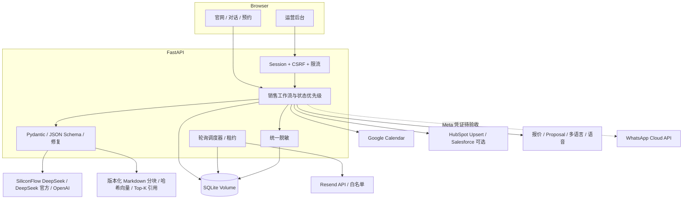
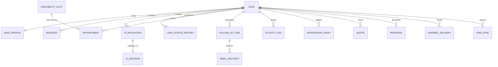
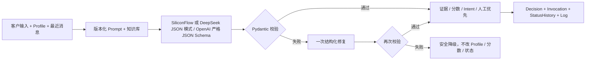
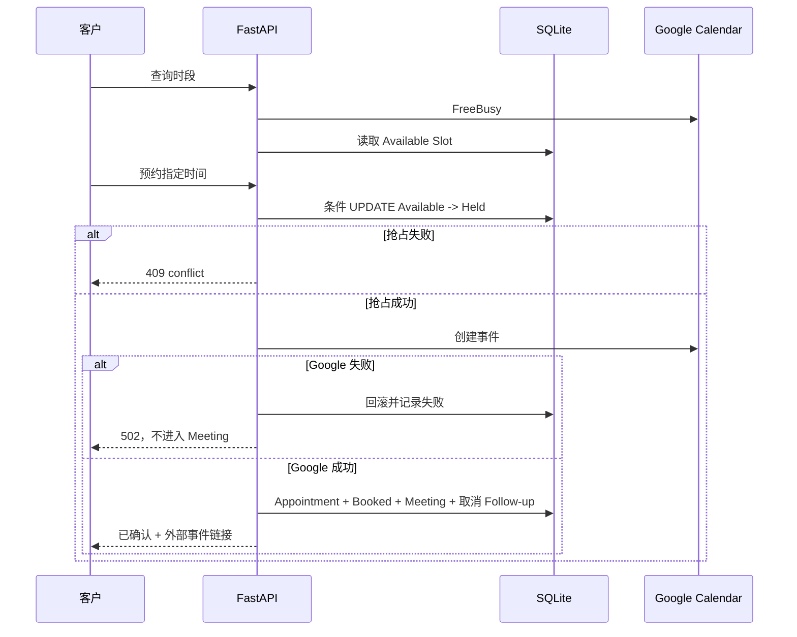
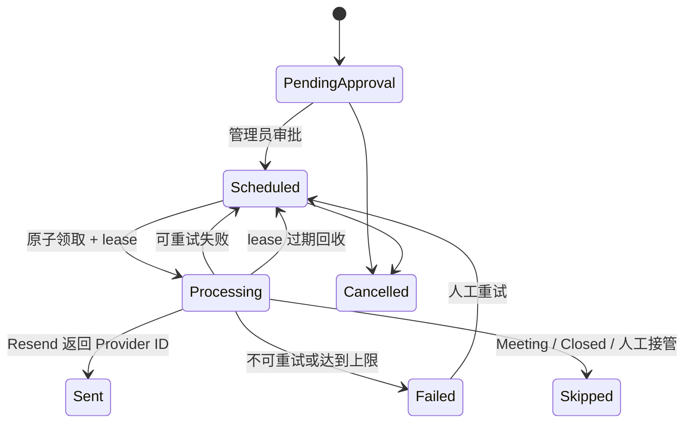
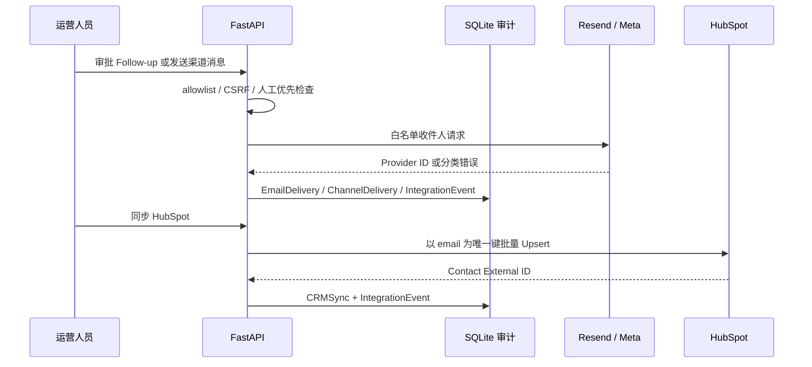

# 架构、数据模型与时序

## 组件架构

## ERD

## AI 工作流

状态优先级为 `Closed > manual_status > human_takeover > AI suggestion`。模型只提出建议，应用代码拥有状态写权限。

## 预约时序

## Follow-up 调度

所有时间以 UTC 存储。客户端提交无偏移时间时，服务端按请求中的 IANA 时区解释；返回时间显式携带 UTC 偏移。当前独立加分版的 Resend 与 HubSpot 已真实验收；WhatsApp 仍受 Meta 账号申诉阻塞。

## 多渠道与 CRM 时序

